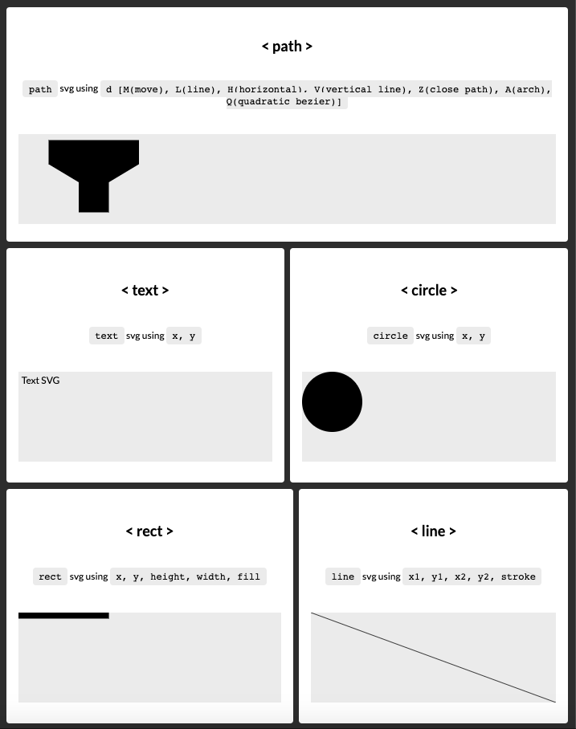

# SVG & CSS –– Animation for the Web
Project: use user interaction(s) to animate an SVG home made.

<!--  -->

### What is SVG ?
SVG - Scalable Vector Graphics: **vector graphic format-based in XML**.  
It is a powerful and **scallable vectorial picture**  
that uses code accordingly to "paint" a vectorial picture.  
Usually used for icons, it can be used for lovelies animations  
responding to the user  interactions ( hover, clicks, etc ...)  
and much more !


<legend>Codepen SVG exploration  

<i>( for the code: click the button "change view" > "editor view" )</i></legend>  

<a href="https://codepen.io/laurelineparis/full/VwYWbOa" target="_blank"></a>

### Understand path in SVG
- **Viewbox and Viewport**
    SVG have their own attribute height and width in which it is  
    possible to use: %, em, rem, px.  
    
    | SVG Attributes |  |  
    |:-------:|:--------:|
    | ViewPort | SVG's size is related to its container
    | ViewBox | defines new coordinates system within the SVG canvas |
- **Coordinates**:
    Are starting from the **top-left** at 0,0.  
    
    | AXIS          |                                |
    |:-------------:|--------------------------------|
    | **X**             | **horizontal**: from left to right |
    | **Y**             | **vertical**: from top to bottom   |
- **SVG elements**:  

    |    ELEMENTS   |MAIN ATTRIBUTES|                |
    |:-------------:|:-------:|----------------|
    | **text**      |```x, y, fill```| creates text elements |
    | **circle**    |```cx, cy, r, fill ```| creates circles       |
    | **rect**      |```x, y, height, width, fill ```| creates rectangles    |
    | **line**      |```x1, y1, x2, y2, stroke ```| creates lines         |
    | **path**      |```d, fill, stroke, stroke-width```| creates path between two points |
    |       |```M (x, y)```| M - Move: Starting point, |
    ||```L (x, y)```| L - Line: draws a line, |
    ||```H (x)```| H - Horizontal: draws a line horizontally, |
    ||```V (y)```| V - Vertical: draws a line vertically, |
    ||```Z```| Z - Closes Path: draws a line back to start, |
    ||```A```| A - Arch: needs more explanation |
    ||```Q```| Q - Quadralitic: needs more explanation |
    | **textpath**  |```x, y, fill```| add text along path         |
    | **polygon**   |```x, y, fill```| creates polygons with sets of x and y |
    | **use** || clone and reuse graphical svg elements |
    | **symbol**|| never rendered but by using ```<use>``` element |
    | **g**|       | groups separated elements |


- **Use SVG in web pages**  

    | HOW | |
    |:---:|:---|
    | HTML | Inline SVG code |
    |  | Using `````` |
    |  | Using ```<object>``` |
    |  | Using ```<iframe>``` |
    |  | Using ```<embed>``` |
    | CSS | background-image |


### I. Animation with CSS
- **Create SVG**: Creating an SVG out of vectorial softwares is pretty simple.  
*( Illustrator, Photoshop, Affinity Design, Vectr, ... ).* 
- **Export SVG**: Export as SVG either as code based (recommanded) or a file.
Usually your grouping folders' names, turn out to be **id** used within your SVG.
- **Use SVG**: Within HTML paste the SVG code (or use ```img``` tag)
- **Anime SVG (CSS)**: Handles SVG parts using selectors and add animations.


### II. Animation with < animate >
| TAG ||
|:--:|:--:|
|```<animate>```| Animation tag build in SVG itself. Defines how an attribute will move from this initial position to the end during the duration specified |


### III. Resources
Here interesting ressources
- [CSS trick](https://css-tricks.com/svg-path-syntax-illustrated-guide/)